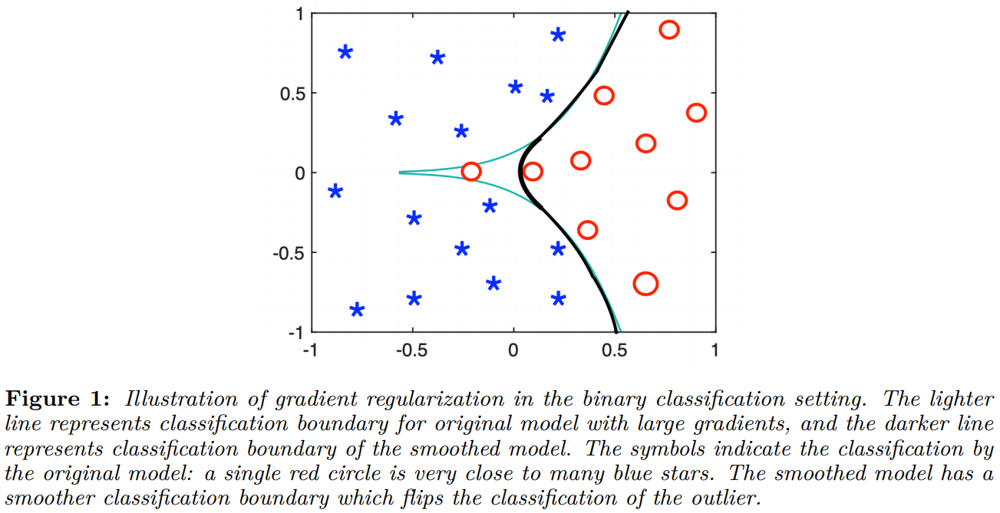
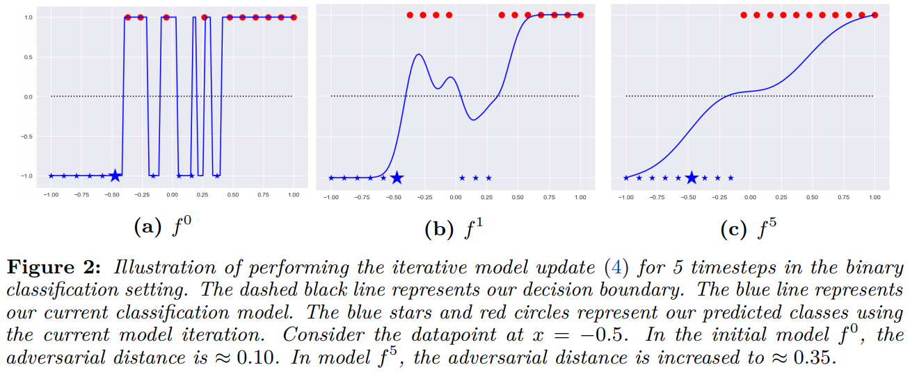
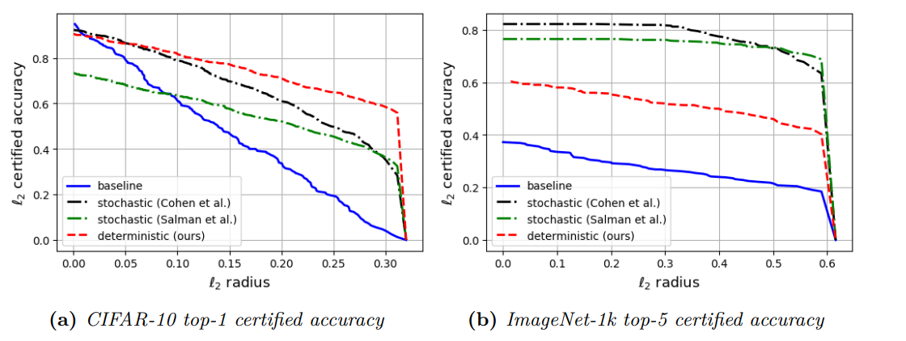
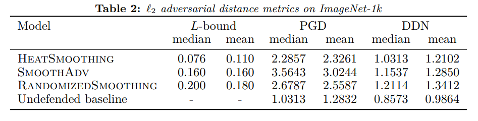
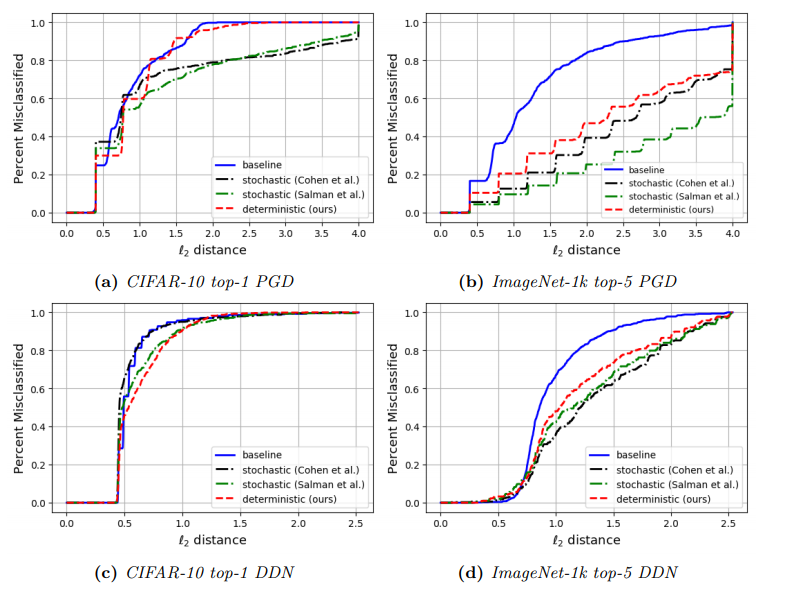
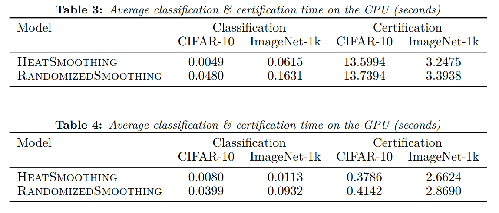

# HeatSmoothing

## Deterministic Averaging Neural Netowrks

The following code associated with [Deterministic Gaussian Averaged Neural Networks](https://arxiv.org/abs/2006.06061) submitted to NeurIPS 2020. We implement a variational method to deterministically average DNNs.

Randomizd smoothing is a known stochastic method to achieve a Gaussian average of some initial model. However, we can also achieve a Gaussian averaged model by training with some regularized loss (see Figure 1). In this work, we present an iterative determinmistic smoothing method for classification neural networks, as opposed to well known stochastic methods. This form of iterative smoothing is illustrated in Figure 2.

<p align="center">


</p>
The code for Figure 2 is presented in `figs/avging_fig.ipynb`. 

In our experiments, we test our iterative method on the CIFAR-10 and ImageNet-1k datasets. We compare our models to those of [Cohen et. al](https://github.com/locuslab/smoothing) and [Salman et. al](https://github.com/Hadisalman/smoothing-adversarial).

The first experiment is to compute the L2 certified accurcies using the method implemented in [Cohen et. al](https://github.com/locuslab/smoothing/blob/master/code/core.py). Results are presented in Figure 3.
<p align="center">

</p>
Our certified accuracy plotting code is presented in `figs/cert_plots.ipynb`.

Next, we compute a lower bound on adversarial distance using the Lipschitz constant of averaged models. We also attack our models using the PGD and DDN attacks. Results for CIFAR-10 and ImageNet-1k are presented in Tables 1 & 2 and in Figure 4.
<p align="center">



</p>
Our attack curve plotting notebook is given in `figs/adv_plots.ipynb`.

A result of deterministic smoothing is faster inference computation time. When performing classification, our models do not require a randomized smoothing procedure as is done with stochastic models from Cohen et. al. This faster computation time on the CPU and GPU in Tables 3 & 4.
<p align="center">

</p>

## Experiments

The code is tested with python3 and PyTorch v1.5.0 (along with torchvision and CUDA toolkit version 10.2). See https://pytorch.org/get-started/locally/ for installation details.

Then clone this repository and run `cd HeatSmoothing`.

### CIFAR-10 Experiments

To begin, run `cd cifar10`.

#### Training

Train the base model, Cohen model, and Salman model by running
```
./run.sh
```
from the command line with the correct script selected on line 42.

To train our averaged model, run
```
python train_ours.py --data-dir 'PATH TO CIFAR-10 DATASET' --init-model-dir 'DIRECTORY OF THE TRAINED BASE MODEL' --pth-name 'best.pth.tar'
```
from the command line.

Alternatively, the four pretrained models can be downloaded [here](https://drive.google.com/file/d/1p0TXoOeQfvkgXkHqaXY7YAmjhRdmN-S8/view?usp=sharing).

#### Certification

As well as computing the certified *L2* certified radius, our certification code also computed classification and certification times. To certify the baseline and our adveraged models, cd into `certify` and run the following from the command line,
```
python certify.py --data-dir 'WHERE THE DATA IS STORED' --model-dir 'MODEL DIRECTORY' --pth-name 'MODEL PATH.pth.tar'
```
For the Cohen and Salman models, run
```
python certify.py --data-dir 'WHERE THE DATA IS STORED' --model-dir 'MODEL DIRECTORY' --pth-name 'MODEL PATH.pth.tar' --is-cohen
```
Using the resulting .pkl dataframes, make the certification plot (Figure 3(a)) using the code provided in the notebook `figs/cert_plots.ipynb`.

#### Attacking

First, compute the *L*-bound from the paper for any of our baseline and our averaged models by running
```
python test_statistics.py --data-dir 'LOCATION OF DATA' --model-dir 'WHERE MODEL IS STORED' --pth-name 'PATH NAME.pth.tar'
```
For the Cohen and Salman models, run
```
python test_statistics.py --data-dir 'LOCATION OF DATA' --model-dir 'WHERE MODEL IS STORED' --pth-name 'PATH NAME.pth.tar' --is-cohen
```

Now it is time to perform the DDN and PGD attacks. First, **uncomment lines 94-95 in `/cifar10/attack/salman_attacks.py`**. When attacking our models, we want to terminate the attack if the model is successfully adversarially perturbed. To attack our baseline and our averaged models, cd into `attack` and run the following from the command line
```
python run-attack.py --data-dir 'WHERE THE DATA IS STORED' --model-dir 'MODEL DIRECTORY' --pth-name 'MODEL PATH.pth.tar' --criterion 'top1' --attack 'DDN or PGD'
```
To attack the Cohen and Salman models, run
```
python run-attack.py --data-dir 'WHERE THE DATA IS STORED' --model-dir 'MODEL DIRECTORY' --pth-name 'MODEL PATH.pth.tar' --criterion 'cohen' --attack 'DDN or PGD'
```
Using the resulting .npz adversarial distances, make the attack curves (Figures 4(a)(c)) using the code provided in the notebook `figs/adv_plots.ipynb`.

### ImageNet-1k Experiments

Now, run `cd imagenet`.

#### Training

Here, we use code modified from [Tulip](https://github.com/cfinlay/tulip/tree/master/imagenet) and [Train ImageNet in 18 minutes](https://github.com/cybertronai/imagenet18). This fast ImageNet training is obtained by training on smaller images. If you run locally, you may need to download the special ImageNet dataset yourself from [here](https://s3.amazonaws.com/yaroslavvb2/data/imagenet18.tar). This faster training is achieved by training on special smaller images for the first 15 epochs or so.

To train a base model, simply execute
```
./run.sh
```
from the command line.

Using this initial model, train the deterministic averaged model by running
```
./run_ours.sh
```
Alternatively, you can download the pretrained version of these two models, along with the pretrained Cohen and Salman models [here](https://drive.google.com/file/d/1Gvt6zNAnAAZaOiPWcCc_CzkFJV3k-_GL/view?usp=sharing).

#### Certification

As well as computing the certified *L2* certified radius, our certification code also computed classification and certification times. Run `cd certify`. To certify the baseline model and our averaged model by running
```
python certify.py --datadir 'DIRECTORY WHERE IMAGENET VALIDATION DATASET IS STORED' --model-path 'MODEL PATH.pth.tar' --std 0.25 --rule 'top5'
```
For the pretrained Cohen and Salman models, the respective model loading code is slightly different. For the Cohen model, run
```
python certify-cohen.py --datadir 'DIRECTORY WHERE IMAGENET VALIDATION DATASET IS STORED' --model-path 'COHEN MODEL PATH.pth.tar' --std 0.25 --rule 'top5' --is-cohen
```
and for the Salman model, run
```
python certify-salman.py --datadir 'DIRECTORY WHERE IMAGENET VALIDATION DATASET IS STORED' --model-path 'SALMAN MODEL PATH.pth.tar' --std 0.25 --rule 'top5' --is-cohen
```
Using the resulting .pkl dataframes, make the certification plot (Figure 3(b)) using the code provided in the notebook `figs/cert_plots.ipynb`.

#### Attacking

First, compute the *L*-bound from the paper for any of our baseline and our averaged models by running
```
python test_statistics.py --datadir 'DIRECTORY WHERE IMAGENET VALIDATION DATASET IS STORED' --model-path 'MODEL PATH.pth.tar' 
```
For the Cohen and Salman models, be sure to uncomment the appropriate lines in `test_statistics.py` and run
```
python test_statistics.py --datadir 'DIRECTORY WHERE IMAGENET VALIDATION DATASET IS STORED' --model-path 'COHEN or SALMAN MODEL PATH.pth.tar' --is-cohen
```

Run `cd attack`. To attack  the baseline model and our averaged model by running
```
python run-attack.py --datadir 'DIRECTORY WHERE IMAGENET VALIDATION DATASET IS STORED' --model-path 'MODEL PATH.pth.tar' --attack 'DDN or PGD' --criterion 'top5'
```
For the Cohen model, run
```
python run-attack-cohen.py --datadir 'DIRECTORY WHERE IMAGENET VALIDATION DATASET IS STORED' --model-path 'COHEN MODEL PATH.pth.tar' --attack 'DDN or PGD' --criterion 'cohen'
```
For the Salman model, run
```
python run-attack-salman.py --datadir 'DIRECTORY WHERE IMAGENET VALIDATION DATASET IS STORED' --model-path 'SALMAN MODEL PATH.pth.tar' --attack 'DDN or PGD' --criterion 'cohen'
```
Using the resulting .npz adversarial distances, make the attack curves (Figures 4(b)(d)) using the code provided in the notebook `figs/adv_plots.ipynb`.

## Citations

Please cite as
```
@misc{campbell2020deterministic,
    title={Deterministic Gaussian Averaged Neural Networks},
    author={Ryan Campbell and Chris Finlay and Adam M Oberman},
    year={2020},
    eprint={2006.06061},
    archivePrefix={arXiv},
    primaryClass={cs.LG}
}
```
